# 使い方

## 起動方法

### Windows 版

起動しようとすると「Windows によって PC が保護されました」というダイアログが表示されるかもしれません。その際は「実行」をクリックしてください。

### Mac 版

初回起動時は Apple に登録されていないアプリケーションとして警告ダイアログが表示されるかもしれません。


その際は Finder で `Ctrl` キーを押しながら AivisSpeech アプリケーションアイコンをクリックし、ショートカットメニューから「開く」を選択してから、「開く」をクリックしてください。

もしくは、アップルメニューから「システム設定」を選択して「プライバシーとセキュリティ」 をクリックし、ページの下にあるセキュリティの「このまま開く」を選んでください。


macOS Ventura 以前をお使いの場合は、アップルメニューから「システム環境設定」を選択して「セキュリティとプライバシー」 をクリックし、「一般」パネルで「このまま開く」選んでください。


#### Apple Silicon 搭載の Mac をお使いの場合

初めて AivisSpeech を起動する際に Rosetta のインストールを促される場合は、案内に従ってインストールしてください。


## 音声合成エンジンの起動

最初に音声合成エンジンが起動します。  
GPU をお持ちの方は、音声の生成がずっと速い GPU モードを快適にご利用いただけます。

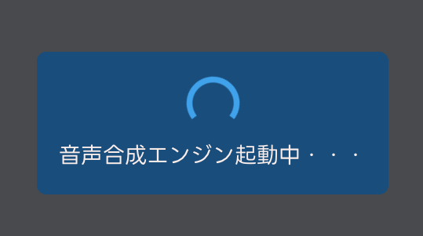

## 音声の生成・再生

音声合成モデルアイコンの右にある空白をクリックしてテキストを入力してみてください。

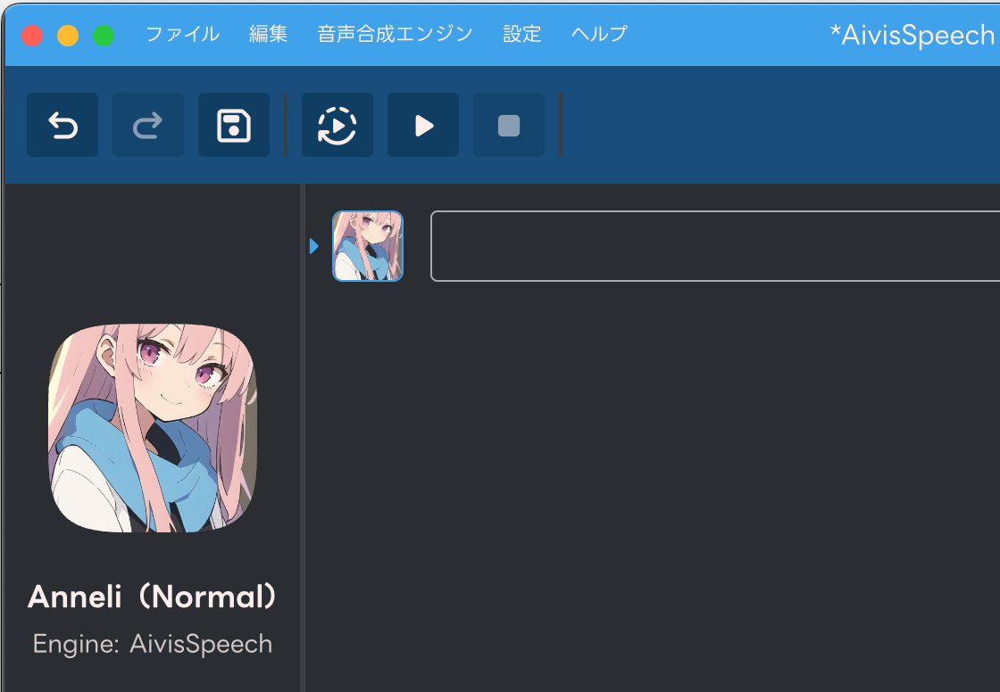

`Enter` キーを押して文章を確定すると、画面の下の方に読みとアクセントが表示されます。（１回目は反映まで数秒ほど時間がかかることがあります。）

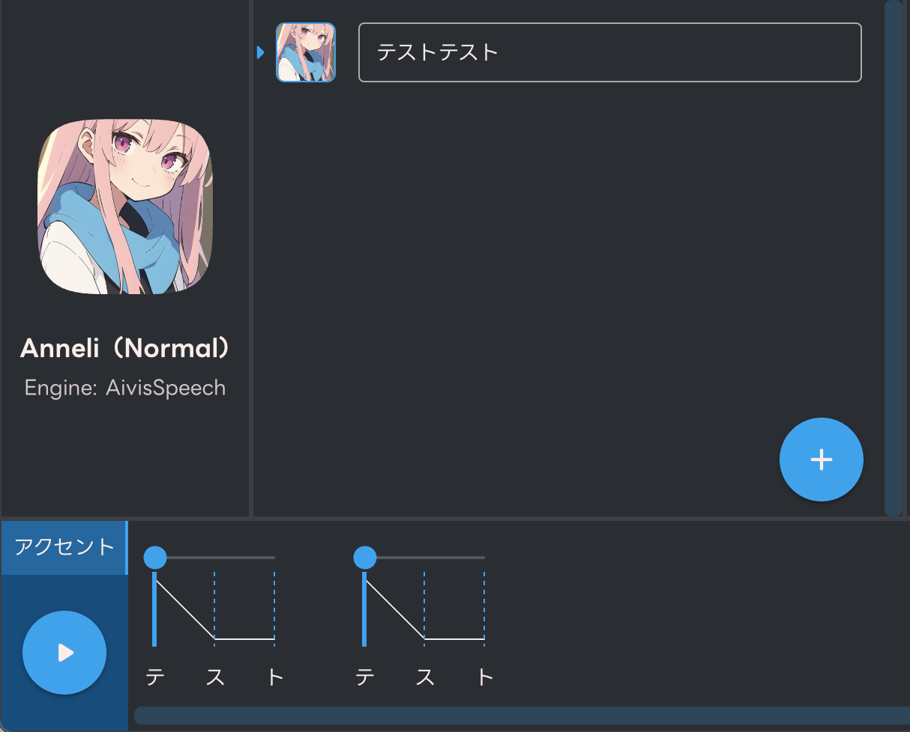

再生ボタンを押すと音声が生成され、音声が再生されます。

## 文章の追加・削除

右下の＋ボタンを押すとテキスト欄が増え、複数の文章を並べることができます。

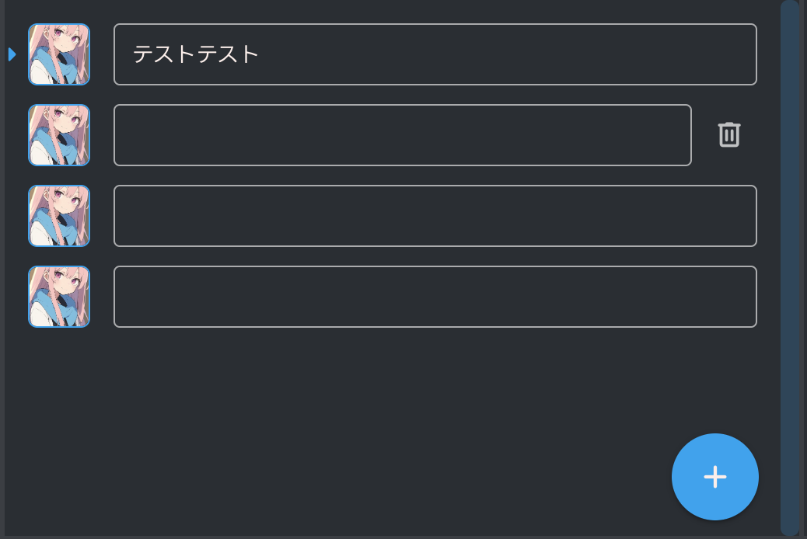

テキスト欄にマウスカーソルを合わせると出てくるゴミ箱のボタンで、そのテキスト欄を削除できます。

## 音声合成モデルの変更

テキスト入力欄の左にあるアイコンをクリックすると、テキストを読み上げてくれる音声合成モデルを変更することができます。

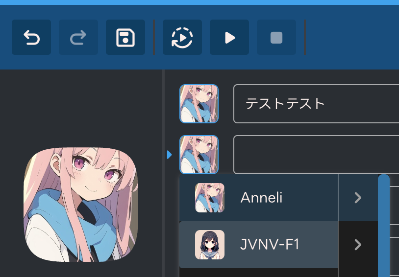

音声合成モデルの表示順序は「音声合成モデル並び替え」で変更できます。

## テキスト欄の並び替え

テキスト欄周辺をドラッグすることで、テキスト欄の順番を並び替えられます。

## 単語の接続変更

意図しない箇所で単語が分離していた場合や、意図しない形で結合してしまっている場合は、アクセント項目で文字の間をクリックすることで修正できます。

例えば「ディープラーニング」がこのように分かれてしまった場合は、

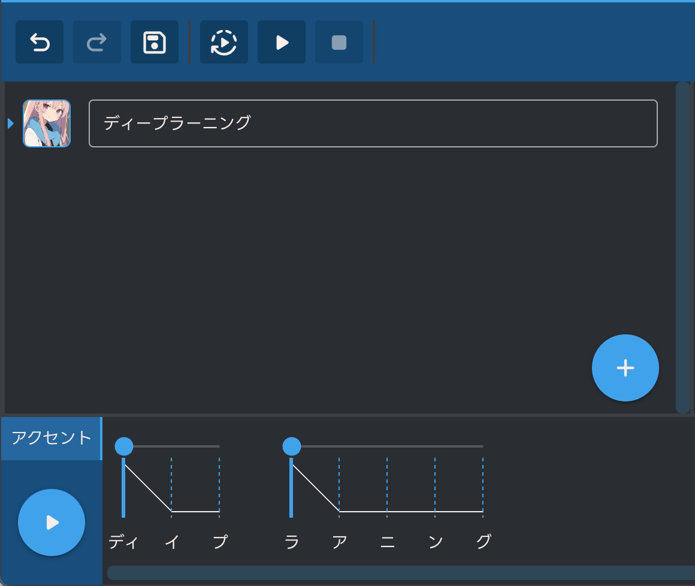

２つの隙間をクリックすると

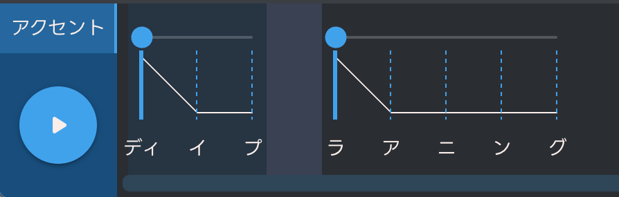

このように１語にまとめることができます。

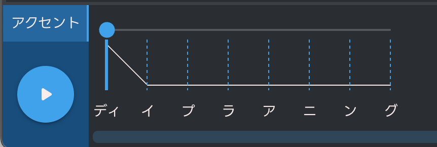

逆に切り離したい場合は、文字の間をクリックして切り離すことができます。

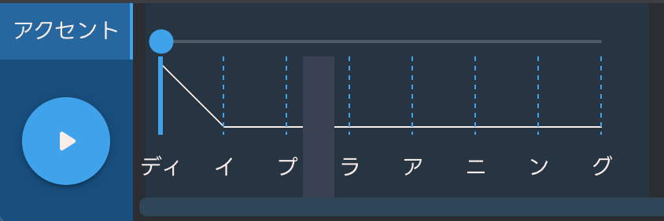

## アクセントの変更

アクセント箇所を変えるには、読みの上にあるバーを左右に動かします。  
例えば「ディープラーニング」を「↑ ディープラ ↓ アニング」と読んでほしい場合は、「ラ」の位置まで丸をスライドします。

 → 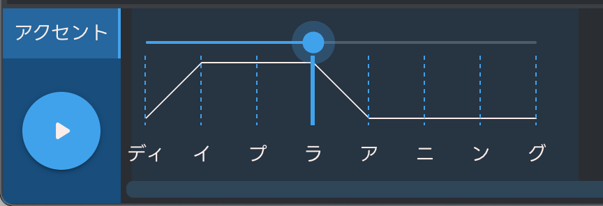

## パラメータの変更

画面の右の欄で、テキスト欄ごとに話速やテンポの緩急などのパラメータを変更することができます。

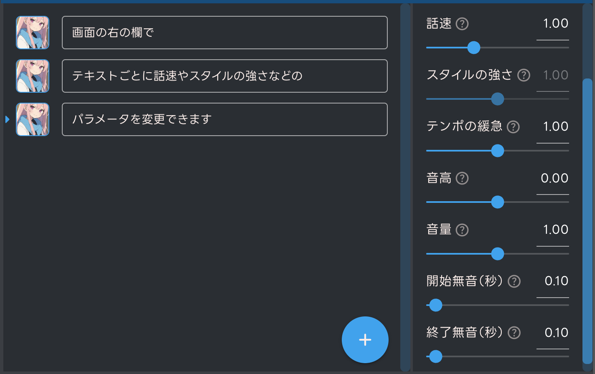

- 話速
  - 読み上げ速度を変更できます。数値が大きいほど速くなります。
- 音高
  - 読み上げの高さを変更できます。数値が大きいほど高くなります。
- テンポの緩急
  - 読み上げのテンポの緩急を変更できます。数値が大きいほどより早口で抑揚がついた音声になります。
- 音量
  - 音声の音量を変更できます。数値が大きいほど音が大きくなります。
- 開始無音・終了無音
  - 音声の先頭や末尾の無音の長さを変更できます。数値が大きいほど無音時間が長くなります。

## 読みの修正

読みが思っているものと違う場合は、アクセント欄で読みをクリックすることで後から修正することもできます。  
テキスト欄と同様に、ひらがなや句読点、漢字も入力できます。

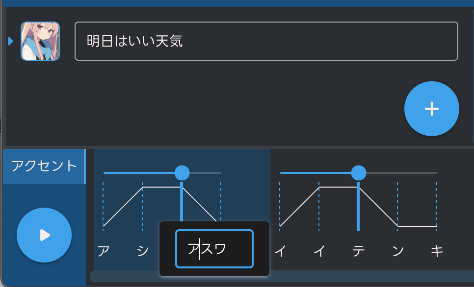

修正箇所以外の調整結果はそのままなので、調整結果を維持したままテキストを修正したいときにも便利です。

## スタイルの変更

音声合成モデルによっては複数のスタイル（喋り方）を変えることができます。音声合成モデルの変更と同様に、テキスト欄左のアイコンから選択できます。

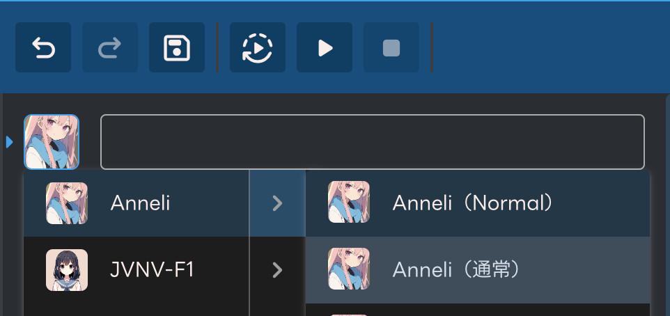

音声合成モデルを選択したときに適用されるスタイルは、設定の「デフォルトスタイル」で変更できます。

## 音声ファイルの書き出し

メニューにある「ファイル」の「音声書き出し」ボタンを押すと、全テキスト欄の音声が WAV ファイルとして書き出されます。  
ファイル保存時、ファイル名は `[何行目]_[キャラ名]_[テキスト冒頭].wav` として保存されます。設定でテキストファイルも一緒に書き出すこともできます。ファイル名は設定の「書き出しファイル名パターン」で変更できます。

## テキストファイルの読み込み

読み込みボタンを押すとテキストファイルを読み込めます。  
テキストは改行または半角コンマ（,）で区切ることで分割できます。  
また、音声合成モデル名だけで区切ることで、その音声合成モデルとして読み込むことができます。

例えばこのようなテキストを読み込むと、

```txt
四国めたん,おはようございます,こんにちは
ずんだもん,こんばんは
四国めたん（あまあま）,さようなら
```

このように読み込まれます。

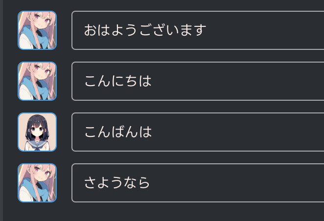

スタイル名が指定されていない場合は、デフォルトスタイルのスタイルが適用されます。

## テキストをつなげて書き出し

メニュー「ファイル」の「テキストをつなげて書き出し」ボタンで、すべてのテキストを書き出すことができます。  
テキストは音声合成モデル名も一緒に保存され、上の「テキストファイルの読み込み」で読み込むこともできます。

## プロジェクトファイルの保存・読み込み

入力したテキストや音声合成モデル、アクセント修正やイントネーションの調整結果は、プロジェクトファイルとして保存し、ソフトウェアを起動し直した後で読み込むことができます。  
プロジェクトファイルの拡張子は `.aisp` です。

## 音声合成モデルの管理

「設定」の「音声合成モデルの管理」で、音声合成モデルの表示順序を変更することができます。  
また、音声合成モデルごとのサンプルボイスを試聴することもできます。

## デフォルトスタイル

「設定」の「デフォルトスタイル」で、音声合成モデルごとのデフォルトのスタイルを変更することができます。

## 読み方＆アクセント辞書

難しい単語や新しい単語は正しい読みにならないことがありますが、辞書機能を使って読み方を登録しておくことができます。  
辞書機能は「設定」の「読み方＆アクセント辞書」で利用できます。

読み方＆アクセント辞書画面を開くと、左に登録した単語のリストが表示されます。  
「追加」ボタンで新規に単語を登録できます。

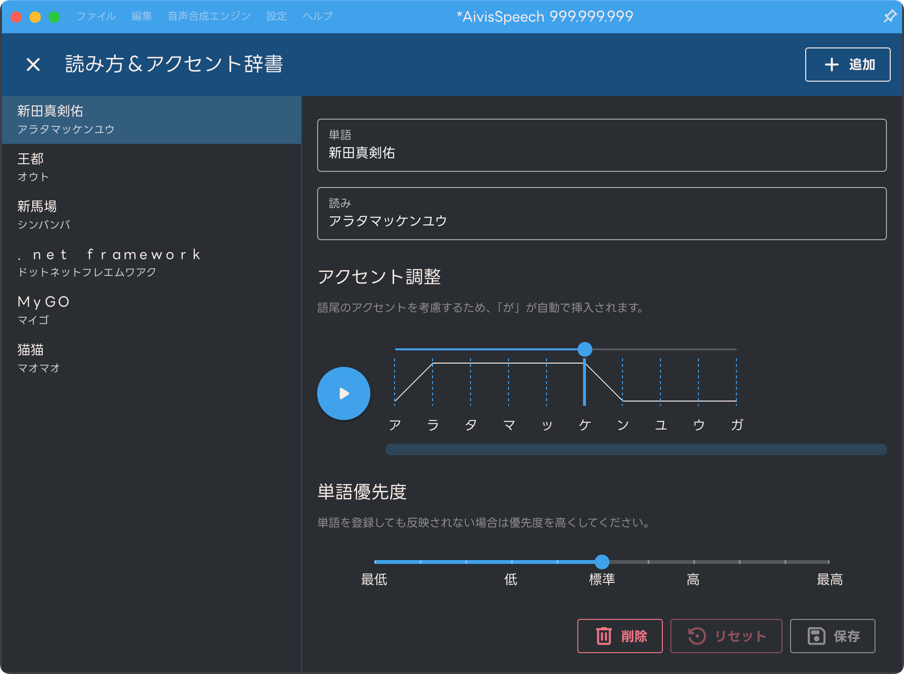

「単語」に登録したいテキストを、「読み」にそのテキストの読み方をひらがなかカタカナで入力してください。  
「アクセント調整」で自然になるアクセントを登録できます。  
もし登録した単語が反映されない場合は、「単語優先度」を上げてみてください。

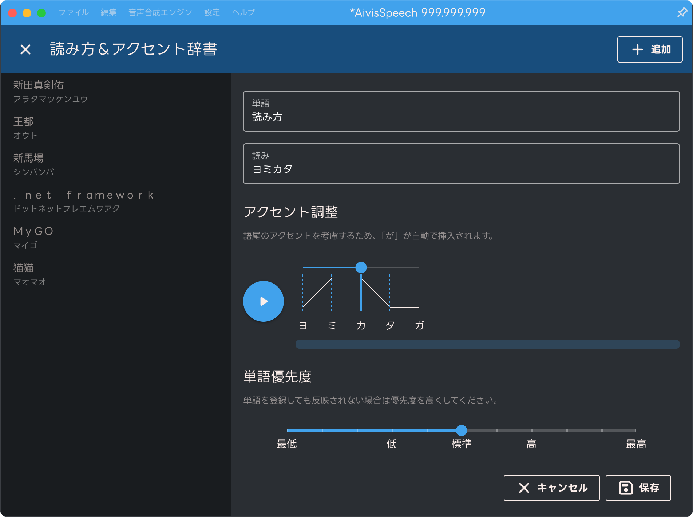

## ツールバーのカスタマイズ

ボタンをドラッグすることにより、画面上部にあるツールバーのボタンの種類や配置を変更することができます。

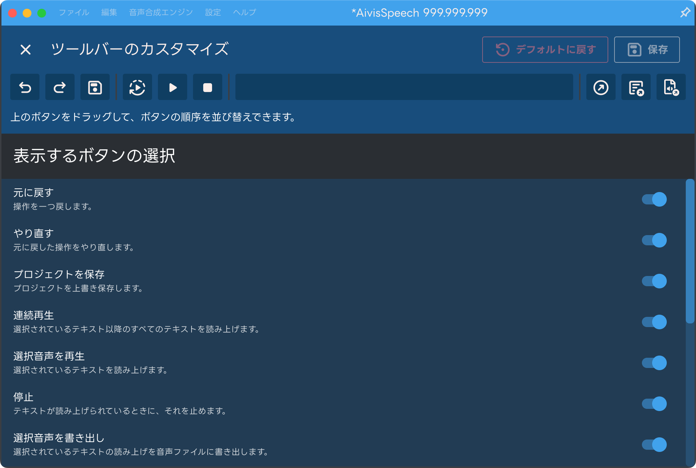

## ショートカットキー

「設定」の「キー割り当て」で変更することができます。  
（Mac 版をご利用の場合は Ctrl を Command に、Alt を Option に読み替えてください。）

- 上下キー
  - 上下のテキスト欄に移動
- `Space`
  - 音声を再生
- `Shift` + `Enter`
  - テキスト欄を追加
- `Shift` + `Delete`
  - テキスト欄を消去
- `Ctrl` + `S`
  - プロジェクトの保存
- `Ctrl` + `E`
  - 音声を書き出し
- `Ctrl` + `Z`
  - 元に戻す
- `Ctrl` + `Y`
  - やり直す
- `Esc`
  - テキスト欄からカーソルを外す
- スライダーの上でマウスホイール
  - スライダーの値を変更します（スライダー →）
  - `Ctrl` キーを押しながらマウスホイールを使うと更に細かく調整できます
  - `Alt` キーを押しながらイントネーションや長さを調整することで、同じアクセント区間内を同時に調整できます

## オプション

「設定」の「オプション」でいろいろな設定を変更することができます。

### 「音声合成エンジン」項目

音声合成エンジンの起動モードの起動モードを変更できます。

#### エンジンモード

GPU モードを利用するには、GPU が必要です。

#### 音声のサンプリングレート

音声のサンプリングレートを変更して再生・保存します。  
サンプリングレートを高くしても音声の品質は上がりません。

### 「操作」項目

#### プリセット機能

話速やテンポの緩急などのパラメータをまとめて登録できるプリセット機能を利用できるようになります。ソフトウェアが終了しても設定したプリセットは残ります。  
プリセットを再登録する際、同じプリセットを割り当てているテキスト欄のパラメータを一括で変更することもできます。

スタイルごとに１つデフォルトプリセットが用意されています。

#### スタイル変更時にデフォルトプリセットを適用

プリセット機能をオンにしている場合、スタイルを変更したときにデフォルトプリセットを自動的に適用するようになります。

#### パラメータの引き継ぎ

テキスト欄を追加する際、話速やテンポの緩急といったパラメータを引き継ぐようになります。

#### 再生位置を追従

再生中の単語が画面内に収まるよう、自動的にスクロールして追従するようになります。

#### テキスト自動分割

テキストを貼り付ける時、句点や改行でテキストを分割するかの挙動を変更できます。

#### メモ機能

テキストを `[]` で囲むことで、テキスト中にメモを書けます。半角の `[]` と全角の `［］` のどちらにも対応しています。

#### ルビ機能

テキストに `{ルビ対象|よみかた}` と書くことでテキストの読み方を変えられるようになります。  
半角の `{|}` と全角の `｛｜｝` のどちらにも対応しています。書き出しテキストを変えずに読み方を変えたいときに便利です。

### 「保存」項目

#### 書き出し先を固定

音声ファイルを書き出すフォルダを固定し、毎回フォルダを選択しなくても同じフォルダに書き出し続けるようにします。

#### 書き出しファイル名パターン

音声やテキストファイルなどを書き出す際のファイル名をカスタマイズできます。

#### 上書き防止

同じファイル名のファイルがあった場合に連番として保存します。

#### 文字コード

読み込み・書き込み用の文字コードを選択できます。

#### txt ファイルを書き出し

テキスト内容を一緒に保存します。

#### lab ファイルを書き出し

リップシンクなどに便利な、音声の音素情報とそのタイミング情報が書かれたラベルファイルを一緒に保存します。

### 「外観」項目

#### 行番号の表示

テキスト欄の左に行番号を表示します。

#### テキスト追加ボタンの表示

テキスト追加ボタンを非表示にできます。ショートカットキー `Shift` + `Enter` でテキスト欄を追加できます。

### 「高度な設定」項目

#### マルチエンジン機能

VOICEVOX API 準拠音声合成エンジンを AivisSpeech 内で利用できるようになります。  
マルチエンジン機能をオンにしたあと、メニューにある「音声合成エンジン」の「音声合成エンジンの管理」に移動し、次のどちらかを実行すると利用できます。

- VOICEVOX API 準拠音声合成エンジンの VVPP ファイルをインストールする
- VOICEVOX 系ソフトウェア内の音声合成エンジンのパスを指定する

#### 音声をステレオ化

音声をモノラルからステレオに変換して再生・保存します。

#### 再生デバイス

音声を再生するデバイスを変更できます。

### 「実験的機能」項目

開発中の便利機能を利用することができます。

#### 複数選択

複数のテキスト欄を選択できるようになります。  
`Shift` キーを押しながらクリックすることで、最後に選択したテキスト欄からクリックしたテキスト欄までのすべてのテキスト欄を選択できます。  
`Ctrl` キーを押しながらクリックすることで、複数のテキスト欄を個別に選択できます。

### 「データ収集」項目

#### ソフトウェア利用状況のデータ収集を許可する

各 UI の利用率などのデータを送信して AivisSpeech の改善に役立てます。  
入力されたテキストデータや音声データの情報は収集しておりませんのでご安心ください。

## その他

右上のピンボタンでウィンドウを最前面に固定できます。

## ヘルプ

利用規約などを確認することができます。

## アンインストール方法

### Windows 版

インストールしたフォルダの中にある Uninstall AivisSpeech.exe を実行してください。

### Mac 版

「アプリケーション」フォルダにある AivisSpeech を「ゴミ箱」にドラッグ＆ドロップしてください。  

マルチエンジン機能で追加したエンジンを削除する場合は、Finder のメニューバーの「移動」をクリックし、「フォルダへ移動」をクリックして表示された画面に `~/Library/Application Support/voicevox` と入力して `Enter` キーを押し、`vvpp-engines` フォルダを削除すれば完了です。

## ご感想・ご要望・バグ報告など

ご感想・ご要望は、ぜひ Twitter にてハッシュタグ `#AivisSpeech` を付けてツイートしてください。開発の励みになります。

うまく動かない場合や不具合を見つけられた方は、Twitter にて不具合をハッシュタグ `#AivisSpeech` を付けてツイートしていただくか、Aivis Project 公式 ([@aivis_project](https://twitter.com/aivis_project)) までご報告ください。

その他、 Q&A に掲載されていないご質問があれば Aivis Project 公式 ([@aivis_project](https://twitter.com/aivis_project)) にお問い合わせください。
